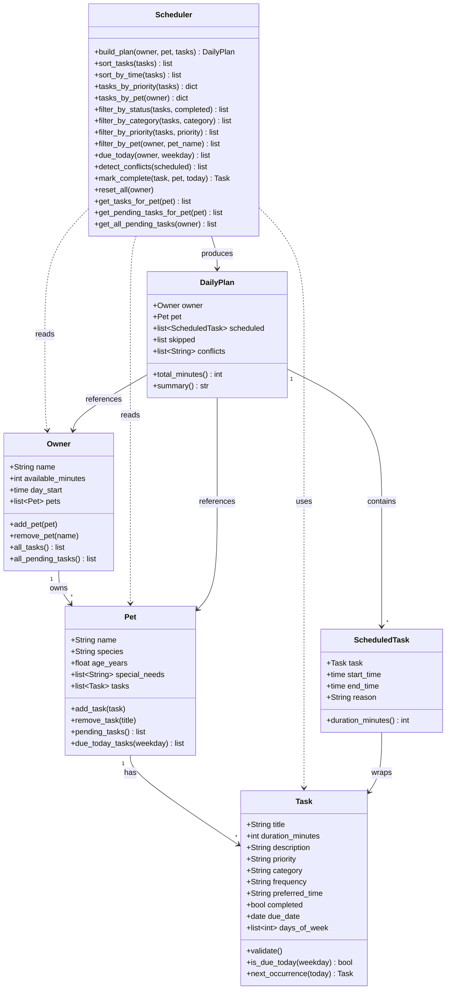

# PawPal+ — Final UML Class Diagram

Paste the code block below into https://mermaid.live to render the diagram,
then export it as uml_final.png.

## Changes from initial UML

| Change | Why |
|---|---|
| `Owner "1" --> "*" Pet` relationship added | Closes the gap identified in design review — Owner now holds a pets list |
| `Pet "1" --> "*" Task` relationship added | Tasks belong to pets, not a separate floating list |
| `Task` gained `frequency`, `due_date`, `days_of_week`, `is_due_today()`, `next_occurrence()` | Recurring task support added in Phase 3 |
| `DailyPlan` gained `conflicts: list[str]` | Conflict detection output stored on the plan |
| `Scheduler` expanded with 10+ new methods | Filtering, sorting, recurring, conflict detection all added |
| `__post_init__` renamed to `validate()` in diagram | Implementation detail replaced with meaningful behavior name |
